# AdmissionFinder — Entity Relationship Diagram

```mermaid
erDiagram
    Institution ||--o{ Cutoff : has
    Institution ||--o{ Deadline : "sets"
    Institution ||--o{ PostUtme : conducts
    Course ||--o{ Cutoff : "has cutoff"
    Course ||--o{ OlevelRequirement : requires
    Course ||--o{ JambSubject : "has subjects"
    Course ||--o{ Career : "leads to"
    User ||--o{ UserOlevel : "has grades"
    User ||--o{ Shortlist : saves
    User ||--o{ Notification : receives
    User ||--o{ Subscription : subscribes
    Institution ||--o{ Shortlist : "is saved"
    Course ||--o{ Shortlist : "is saved"
    DeadLine ||--o{ Subscription : tracks

    Institution {
        string id PK
        string name
        enum type "Federal|State|Private|Polytechnic|College of Education"
        string state
        int established
        string accreditation "Full|Provisional"
        string website
        text description
    }

    PostUtme {
        string institutionId PK,FK
        enum type "CBT|Oral|Written"
        string fee
        int minScore
        string portal
    }

    Course {
        string id PK
        string name
        int duration
        string degree "B.Eng|B.Sc|MBBS|LL.B|HND|NCE|Pharm.D"
        string schoolType "University|Polytechnic|College of Education"
    }

    Cutoff {
        string institutionId PK,FK
        string courseId PK,FK
        int cutoff
    }

    OlevelRequirement {
        string courseId PK,FK
        json credits "e.g. [Mathematics, English, Physics, Chemistry]"
        string plus "Additional requirements"
    }

    JambSubject {
        string courseId PK,FK
        json compulsory "e.g. [Mathematics, Physics, Chemistry]"
        string elective
        string note
    }

    Career {
        string courseId PK,FK
        string title PK
        enum demand "High|Medium|Low"
        string earnings
        json bodies "e.g. [NSE, COREN]"
    }

    Deadline {
        string id PK
        string title
        date date
        enum type "jamb|postutme|general"
        string icon
        string institutionId FK
    }

    User {
        string id PK
        string fullName
        string email UK
        string passwordHash
        string stateOfOrigin
        int jambScore
        int jambYear
        datetime createdAt
        datetime updatedAt
    }

    UserOlevel {
        string userId PK,FK
        string subject PK
        string grade "A1|B2|B3|C4|C5|C6|D7|E8|F9"
    }

    Shortlist {
        string userId PK,FK
        string institutionId PK,FK
        string courseId PK,FK
        datetime savedAt
    }

    Notification {
        string id PK
        string userId FK
        string title
        text message
        enum channel "in-app|email"
        boolean sent
        datetime sentAt
        boolean read
        datetime readAt
    }

    Subscription {
        string userId PK,FK
        string deadlineId PK,FK
        boolean emailEnabled
        boolean inAppEnabled
    }
```

## Core relationships

| Relationship | Description |
|---|---|
| Institution → Cutoff → Course | Many-to-many via Cutoff (an institution has many courses with cut-offs) |
| Course → OlevelRequirement | One-to-one (each course has one set of O'level requirements) |
| Course → Career | One-to-many (one course can lead to multiple career paths) |
| User → Shortlist → Institution/Course | Users save institutions and courses to a shortlist |
| User → UserOlevel | One-to-many (a user has grades in multiple subjects) |
| Institution → Deadline | One-to-many (an institution can have multiple deadlines) |
| User → Subscription → Deadline | Users subscribe to deadline notifications |
